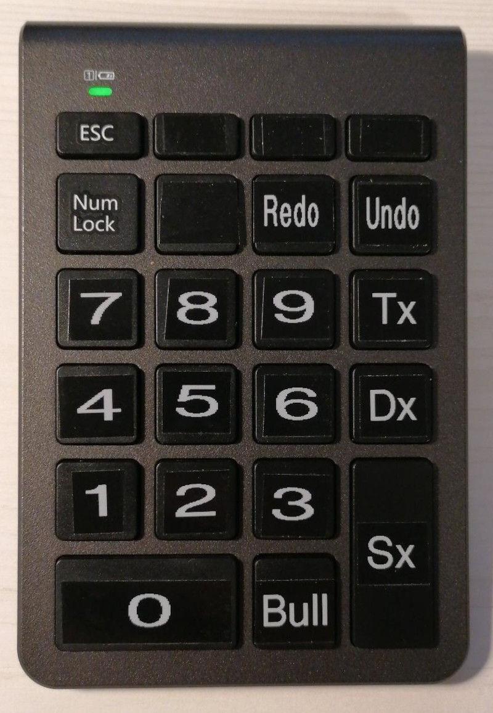

# DartScorer :dart:
Yet another application to manage the game of Steel Dart

<div style="float:left;">

</div>

&nbsp;

The application is written in C++ on base of the following libraries:

- PocoLib https://pocoproject.org/
- FLTK https://www.fltk.org/
- OpenCV https://opencv.org/
- PortAudio http://www.portaudio.com/

DartScorer :dart: supports:

- X01 with different options (set/leg based, double/straight out)
- a simple player management
- audio caller voice (different audio packages available -- visit https://github.com/gromeck/DartScorer-Voices)
- score input via keyboard or bluetooth number keypad -- with unlimited undo and redo
- checkout proposals
- display during gameplay as you know it from TV
- translated frontend (translaters for other languages than EN and DE are welcome)
- simple statistics (average, high scores & finishes, ...)

# Building DartScorer :dart:

To build DartScorer :dart:, install the following packages into your
build environment:

```
apt -y install \
	wget \
	git \
	g++ \
	make \
	automake \
	libxss-dev \
	gettext \
	libpoco-dev \
	libfltk1.3-dev \
	libpocoutil70 \
	portaudio19-dev \
	v4l-conf v4l-utils \
	opencv-data \
	opencv-doc \
	libopencv-video-dev \
	libopencv-videoio-dev \
	libopencv-highgui-dev \
	libopencv-features2d-dev \
	cheese
```

After that, run the script ./build.sh

You can run DartScorer :dart: in the directory Software/src by issuing the command:

```
./DartScorer
```

or simple install DartScorer :dart: by issuing

```
sudo make install
```

In a free-desktop compatible environment DartScorer :dart: will appear in the category of Games.


# Score input via keypad

I recommend a bluetooth keypad to use for manual score input. DartScorer :dart: supports
two different layouts which only differ in PC- or phone-like ordering of the numbers (0 to 9).

An unmodified keypad looks like this:

<div style="float:left;">

</div>


Get some white-on-black tape for our labeling machine and make it look like this:

<div style="float:left;">

</div>


Here is my keypad:

<div style="float:left;">

</div>

| Keypad Key | X11 Symbolic Name | DartScorer :dart: Function |
| ---------- |------------------ | -------------------------- |
| 0          | XK_KP_0           | 0                          |
| :          | :                 | :                          |
| 9          | XK_KP_9           | 9                          |
| .          | XK_KP_Seperator   | Content Cell               |
| Enter      | XK_KP_Enter       | Single                     |
| +          | XK_KP_Add         | Double                     |
| -          | XK_KP_Subtract    | Tripple                    |
| *          | XK_KP_Multiply    | Redo                       |
| Backspace  | XK_Backspace      | Undo                       |


# Some more Screenshots

<div style="float:left;">

</div>

<div style="float:left;">

</div>

<div style="float:left;">

</div>

<div style="float:left;">

</div>

<div style="float:left;">

</div>
